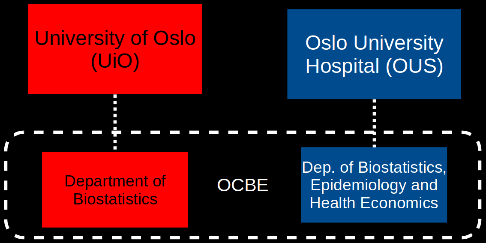
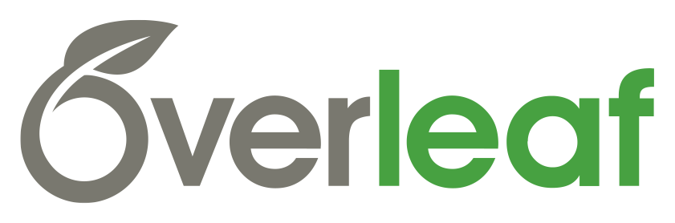
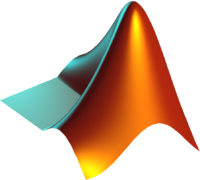

<!--
Lightning talks are presentations that are limited to a maximum of 2 minutes and no more than 2 slides including any title slide. They allow you to introduce your group or give a high-level overview of a project.

We've received your abstract "RSE work done at the Oslo Centre for Biostatistics and Epidemiology" to which we have assigned id #7.

Kind regards,
The organizers of Nordic-RSE Online Get-Together
-->

<!--
header: "
	**RSE work done at OCBE (Oslo Centre for Biostatistics and Epidemiology)**

	Waldir Leôncio Netto
"
-->

 

# What OCBE?

  

  

  

# Where?

  

  :norway: [Domus Medica](https://www.uio.no/english/about/getting-around/areas/gaustad/ga01/), Oslo
  <!-- :globe_with_meridians: https://www.med.uio.no/imb/english/research/centres/ocbe/ -->
   https://github.com/ocbe-uio/

  

# Who?

  

  - 73 scientists, 22 nations
    :australia: :brazil: :canada: :cn: :denmark: :estonia: :ethiopia: 🏴󠁧󠁢󠁥󠁮󠁧󠁿 :finland: :fr: :de:
    :greece: :india: :iran: :it: :nepal: :norway: :es: :switzerland: :gb: :us: 🏴󠁧󠁢󠁷󠁬󠁳󠁿
  * 1 RSE (me)
    - Born and raised :brazil:
    - Background: Statistics (BS, PhD)
    * "RSE is a thing?" (me, 2019)
    * Joins my professional passions
      - Open source (software, sci)
      - Statistical computing

  

---

  

  # How we use computers

  ## Popular software

  

   
    

  

  ## Popular computer languages

  ### Programming

  

      

  

  ### Document production

  

   

  

  

  

  # Biggest RSE challenges

  - Differentiating RSE from IT
  * Heterogeneous staff
    - Skills, expectations, etc.
    - Fantastic for growth!
  * Low adoption of HPC resources
    - Overwhelming availability
    - Requires great computer skills
      - Working without a GUI
      - Writing automated scripts
      - Efficient programming

<!--
No problem understanding what an RSE does. It mixes up a bit with IT
work, though.
-->

  

