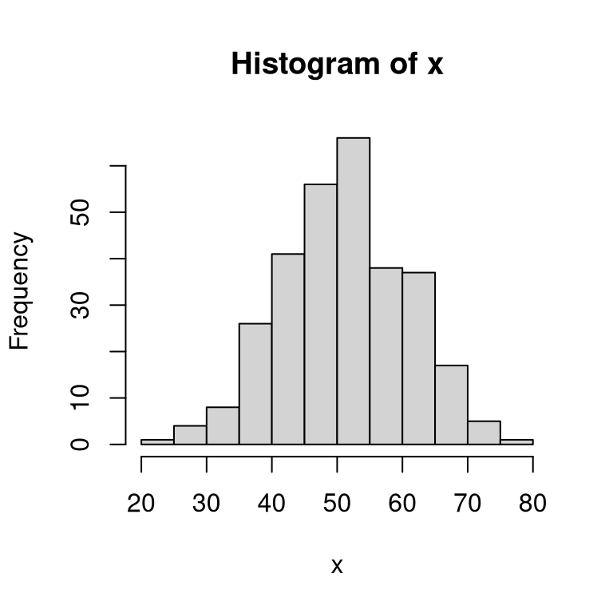
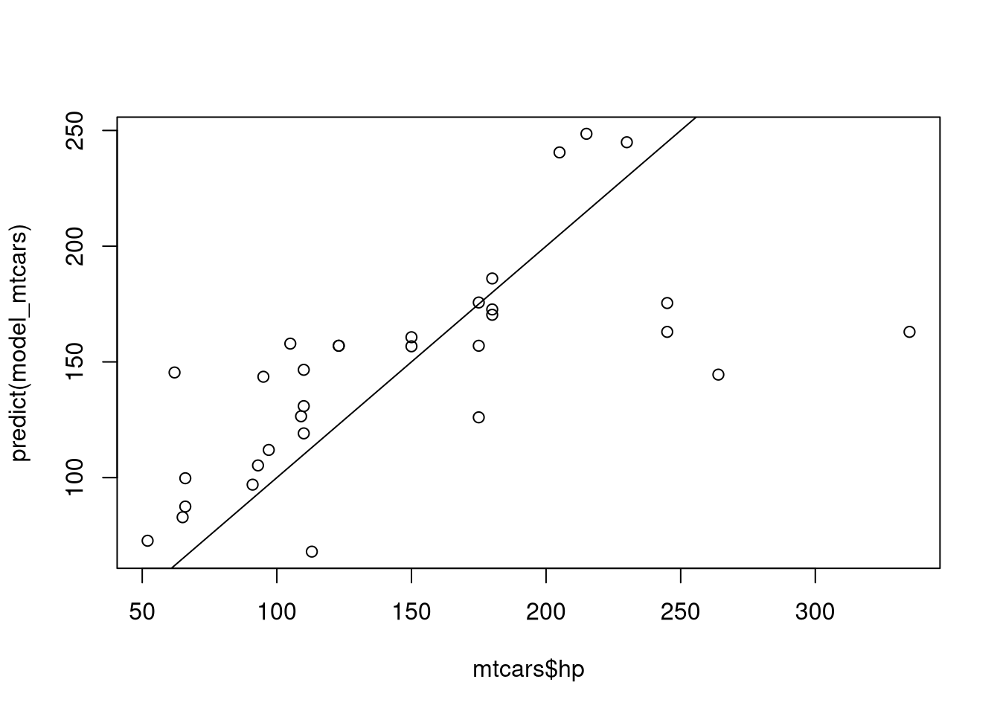

# Scientific programming in R

Waldir Leôncio Netto

Research Software Engineer

Oslo Centre for Biostatistics and Epidemiology ([OCBE](https://www.med.uio.no/imb/english/research/centres/ocbe/))

 [ocbe-uio](https://github.com/ocbe-uio)  [wleoncio](https://github.com/wleoncio)

# Basic info

## Slides
:globe_with_meridians: Will be made available on  [ocbe-uio/public-slides](https://github.com/ocbe-uio/public-slides)

:scroll: Licensed under 

## Workshop

:interrobang: Send/vote questions to https://www.sli.do/, room #083299

:computer: For a better learning experience, try to reproduce the code you see

:spiral_notepad: If you can't/won't write, stick around anyway: you might still learn something :grin:

### Post-it color codes

:yellow_square: Ask presenter to slow down and repeat the last part
:red_square: Ask mentor for help with your R code

---

# Basic structure

1. Algorithms and pseudocoding (basic algo structuring)
2. Installing and running R/RStudio
3. Basic R coding (object types, short examples)
	1. Reading and importing data (rda, xls(x), txt)
	2. Treating data
	3. Analysing data
4. Packages
5. Functions
6. Debugging, profiling and optimizing code
7. Good coding practices

---

# What is an algorithm?

> a finite sequence of <b class="def">well-defined, computer-implementable instructions</b>, typically to solve a class of problems or to perform a computation.

# What is pseudocode?

> a popular form of expressing algorithms which uses <b class="def">structural conventions of a normal programming language</b>, but is intended for human reading

---

# Common pseudocode structures

```bash
print("Hello, world!") # print on screen, not on printer

x = 10 # assignment

# If-else statement
if (x == 10) then
	print(x "equals ten")
	else print(x, "does not equal ten")

y = x - 4

# Loop
for (i in 1:3) do
	print(i)
	y = y + i

```


---

# R is

* a programming language
* ...and a software for statistical computing
* a perfect match for the scientific community
  - Free
  - Open Source
  - Created by scientists (Ihaka & Gentleman; Univ. Auckland, 1993)
* operated through the command line
  - fast (2 hands typing > 1 hand typing + 1 hand back-and-forth on M&K)
  - resource-efficient
  - unambiguous
  - scriptable


---

# How to run R-language software

1) Shell (Operating System terminal)
2) Interactive terminal
3) Graphical interfaces (RStudio, VSCode, etc.)

---

<!-- _class: exercise -->


## Exercise!

1. Open R's interactive terminal:

2. Run this command: `print("Hello, world!")`
3. What is the output?

---

# What is RStudio?

- a Graphical User Interface (GUI) for R
- free
- open Source
- multiplatform (Linux, Windows, Mac)

---

# Installing R and RStudio

- www.r-project.org
- www.rstudio.com
- Your Operating System's package manager/app store/whatever it's called.

---

# Basic R coding

Open R and realize it's just a fancy calculator


```r
 1 + 1
```

```
## [1] 2
```

```r
log(100)
```

```
## [1] 4.60517
```

```r
log(100, base = 10)
```

```
## [1] 2
```

---

## Attribution and object classes

- Attributing: storing values in (RAM) memory


```r
x   <- 10
y   <- 5L
pie <- pi
a   <- "some text"
```

- Also accepted (but more confusing): `=` instead of `<-`.
- `x`, `y`, `pie` and `a` are entities called **objects**.
- Objects have attributes. One of them (the most important?) is their class

---


```r
class(x)
```

```
## [1] "numeric"
```

```r
class(y)
```

```
## [1] "integer"
```

```r
class(pie)
```

```
## [1] "numeric"
```

```r
class(a)
```

```
## [1] "character"
```

---

Classes of some pre-installed R objects


```r
class(mean)
```

```
## [1] "function"
```

```r
class(mtcars)
```

```
## [1] "data.frame"
```

```r
class(HairEyeColor)
```

```
## [1] "table"
```

```r
class(?datasets)
```

```
## [1] "help_files_with_topic"
```

---

# :rotating_light: **D**on't **R**epeat **Y**ourself

## be DRY, not WET (Write Everything Twice)


```r
for (obj in ls()) {
	class       <- class(get(obj))
	output_text <- paste(obj, "is a", class)
	cat(output_text, "\n")
}
```

```
## a is a character 
## pie is a numeric 
## x is a numeric 
## y is a integer
```

(don't worry, you did not sleep through 2 hours of class, I'm just flexing)

---

## Be even DRYer in R!


```r
sapply(ls(), class)
```


```
##           a       class         obj output_text         pie           x           y 
## "character" "character" "character" "character"   "numeric" "character"   "integer"
```

Applying one operation to a vector: vectorization (it's the R way)

Oh, and BTW, keep an eye out for `ls.str()` further ahead.

---

# Don't overthink this, though

- As a scientist, you just need to be an *effective* programmer (i.e., get things done!)
- Being an *efficient* programmer is a bonus (or a job for your local Research Software Engineer :wink:)

---

# Basic operators


```r
 1 + 1
```

```
## [1] 2
```

```r
 pi - 3
```

```
## [1] 0.1415927
```

```r
 6 * 6
```

```
## [1] 36
```

---


```r
 39 / 4
```

```
## [1] 9.75
```

```r
 2 ^ 3
```

```
## [1] 8
```

```r
 5:21
```

```
##  [1]  5  6  7  8  9 10 11 12 13 14 15 16 17 18 19 20 21
```

---

# Logical operators

```r
TRUE
```

```
## [1] TRUE
```

```r
!FALSE
```

```
## [1] TRUE
```

---


```r
TRUE & FALSE
```

```
## [1] FALSE
```

```r
TRUE | FALSE
```

```
## [1] TRUE
```

(put a :yellow_square: up if you want a quick review of truth tables)

---


```r
sequence <- 1:10
sequence == 4 # notice how equality != attribution
```

```
##  [1] FALSE FALSE FALSE  TRUE FALSE FALSE FALSE FALSE FALSE FALSE
```

```r
sequence >= 10
```

```
##  [1] FALSE FALSE FALSE FALSE FALSE FALSE FALSE FALSE FALSE  TRUE
```

```r
sequence != 3
```

```
##  [1]  TRUE  TRUE FALSE  TRUE  TRUE  TRUE  TRUE  TRUE  TRUE  TRUE
```

---

# Subsetting

```r
(x <- 123:157)
```

```
##  [1] 123 124 125 126 127 128 129 130 131 132 133 134 135 136 137 138 139 140 141 142 143 144 145 146 147 148 149 150 151 152 153 154 155 156 157
```

```r
x[5]
```

```
## [1] 127
```

---


```r
(y <- matrix(1:9, nrow=3))
```

```
##      [,1] [,2] [,3]
## [1,]    1    4    7
## [2,]    2    5    8
## [3,]    3    6    9
```

```r
y[2, 3]
```

```
## [1] 8
```

```r
y[1, ]
```

```
## [1] 1 4 7
```

```r
y[, 2]
```

```
## [1] 4 5 6
```

---


```r
print(y)
```

```
##      [,1] [,2] [,3]
## [1,]    1    4    7
## [2,]    2    5    8
## [3,]    3    6    9
```

```r
y[4]
```

```
## [1] 4
```

```r
y[y > 5]
```

```
## [1] 6 7 8 9
```

---

A data frame is a matrix whose columns can have different classes.


```r
(df <- data.frame(person = c("a", "b", "c"), id = c(123, 456, 789)))
```

```
##   person  id
## 1      a 123
## 2      b 456
## 3      c 789
```

```r
df$person
```

```
## [1] "a" "b" "c"
```

```r
df[2, ]
```

```
##   person  id
## 2      b 456
```

---


```r
df[df$person != "c", ]
```

```
##   person  id
## 1      a 123
## 2      b 456
```

```r
df[df$person != "c" & df$id > 200, ]
```

```
##   person  id
## 2      b 456
```

```r
df[df$person != "c" & df$id > 200, "id"]
```

```
## [1] 456
```

---

<!-- _class: exercise -->


## Work it!

1. Run `ToothGrowth` to see one of R's built-in datasets
2. Subset the dataset to show only observations where `supp` equals `OJ`
and `dose` is at least 1.
3. What are the dimensions of the resulting dataset?

---

# Basic, general-purpose R functions

## Handling text and output

```r
print(pi)
```

```
## [1] 3.141593
```

```r
print("Hello, world!") # useful in non-interactive sessions
```

```
## [1] "Hello, world!"
```

```r
cat("Hello, world!") # for printing text in general
```

```
## Hello, world!
```

---

## Handling objects (variables, datasets, functions, etc.)


```r
c(1, 2, 3)
```

```
## [1] 1 2 3
```

```r
c(1, 2, 3, "a")
```

```
## [1] "1" "2" "3" "a"
```

```r
paste(1, 2, 3, "a")
```

```
## [1] "1 2 3 a"
```

---


```r
ls()
```

```
## [1] "a"           "class"       "df"          "obj"         "output_text" "pie"         "sequence"    "x"           "y"
```

```r
rm(output_text)
ls()
```

```
## [1] "a"        "class"    "df"       "obj"      "pie"      "sequence" "x"        "y"
```

---


```r
ls.str()
```

```
## a :  chr "some text"
## class :  chr "integer"
## df : 'data.frame':	3 obs. of  2 variables:
##  $ person: chr  "a" "b" "c"
##  $ id    : num  123 456 789
## obj :  chr "y"
## pie :  num 3.14
## sequence :  int [1:10] 1 2 3 4 5 6 7 8 9 10
## x :  int [1:35] 123 124 125 126 127 128 129 130 131 132 ...
## y :  int [1:3, 1:3] 1 2 3 4 5 6 7 8 9
```

```r
str(a)
```

```
##  chr "some text"
```

---

## Nesting functions


```r
cat(paste("Hello, world!\nPi equals approximately", pi))
```

```
## Hello, world!
## Pi equals approximately 3.14159265358979
```

---

# Getting offline help


```r
?ls.str
??variance
apropos("mean")
example(mean)
```

---

<!-- _class: exercise -->


1. Check the documentation for the `pie()` function:
What does R have to say about pie charts?

---

<!-- _class: exercise -->


## Bonus round

1. What is the command for removing _almost everything_ in the working environment
(tip: check out the examples for `rm()`)
2. What is the command for removing _everything_ in the working environment
(tip: check out the documentation for `ls()`)

---

# Basic statistical functions


```r
set.seed(6775895) # Ask me about RNGesus
x <- rnorm(n = 300, mean = 50, sd = 10)
print(round(x, 1))
```

```
##   [1] 58.6 50.1 39.9 63.0 60.1 61.0 55.3 62.7 51.2 51.9 50.7 42.0 47.4 50.4 49.8 34.1 53.4 69.7 48.8 49.7 50.0 58.4 52.0 30.3 50.0 57.8 59.9 49.3
##  [29] 50.7 45.0 42.3 42.1 49.3 61.3 53.0 52.2 63.7 36.8 56.9 47.8 47.7 62.2 54.7 56.0 54.9 49.7 65.8 51.2 67.0 49.6 54.4 51.4 41.9 67.3 64.2 52.6
##  [57] 68.2 50.7 64.9 47.4 58.6 62.5 60.8 59.3 61.5 51.0 68.4 60.5 57.3 56.5 38.1 69.8 54.3 46.9 50.8 37.4 72.3 49.9 58.2 48.4 64.4 72.1 51.1 58.2
##  [85] 45.3 41.8 35.7 44.9 38.8 63.4 51.2 44.2 53.3 37.0 44.8 43.4 67.7 50.1 67.5 44.1 39.7 20.9 55.5 67.8 46.2 52.2 60.9 27.7 37.3 72.2 40.0 48.5
## [113] 44.2 75.3 44.2 49.8 41.1 33.3 47.4 48.1 44.6 45.7 46.5 47.4 45.9 48.2 61.5 65.8 48.9 57.4 52.1 70.8 51.3 37.3 63.8 52.9 45.5 49.1 40.8 40.8
## [141] 52.5 48.6 42.6 42.2 68.5 54.5 35.0 53.3 42.3 65.1 60.4 56.8 51.9 47.2 49.7 56.4 60.5 36.7 44.0 35.4 53.7 65.7 60.9 52.9 57.1 60.6 27.2 55.5
## [169] 26.3 61.4 56.2 30.4 49.3 43.1 36.8 45.5 50.4 53.0 54.8 41.8 37.4 51.8 52.4 49.7 40.5 49.1 61.3 41.8 61.8 45.4 46.2 46.7 33.2 60.9 56.9 62.3
## [197] 52.7 47.6 37.1 49.7 44.3 43.5 47.3 46.1 46.7 52.5 37.5 66.8 56.1 61.2 55.3 50.4 54.2 46.3 54.3 53.0 33.3 54.9 37.0 34.4 57.0 57.0 59.0 39.3
## [225] 45.4 47.8 38.6 66.7 42.8 46.4 44.7 49.8 60.1 53.9 64.7 51.8 46.4 43.5 37.2 58.3 71.2 54.4 54.6 44.5 50.7 42.8 47.8 62.3 50.9 54.4 50.5 33.9
## [253] 61.8 57.9 45.8 57.6 55.5 53.6 55.6 41.9 51.6 45.2 65.2 50.1 63.2 48.3 63.9 51.2 51.6 51.1 57.9 49.6 63.5 57.9 51.5 54.9 56.0 52.3 57.6 44.6
## [281] 56.6 35.3 44.6 36.6 26.7 53.4 37.8 56.1 61.4 35.8 39.7 43.7 64.3 43.1 50.2 55.6 42.8 54.3 44.6 40.6
```

---


```r
hist(x)
```



```r
summary(x)
```

```
##    Min. 1st Qu.  Median    Mean 3rd Qu.    Max. 
##   20.94   44.61   50.94   51.01   57.47   75.28
```

---

# Linear regression


```r
y     <- x * 5
model <- lm(y ~ x) # attention to the y ~ x + z formula!
print(model)
```

```
## 
## Call:
## lm(formula = y ~ x)
## 
## Coefficients:
## (Intercept)            x  
##           0            5
```

---

More useful than `print(model)` is `summary(model)`:

```
## Warning in summary.lm(model): essentially perfect fit: summary may be unreliable
```

```
## 
## Call:
## lm(formula = y ~ x)
## 
## Residuals:
##        Min         1Q     Median         3Q        Max 
## -8.756e-14 -1.093e-14 -2.210e-15  7.870e-15  7.431e-13 
## 
## Coefficients:
##              Estimate Std. Error   t value Pr(>|t|)    
## (Intercept) 0.000e+00  1.419e-14 0.000e+00        1    
## x           5.000e+00  2.734e-16 1.829e+16   <2e-16 ***
## ---
## Signif. codes:  0 '***' 0.001 '**' 0.01 '*' 0.05 '.' 0.1 ' ' 1
## 
## Residual standard error: 4.56e-14 on 298 degrees of freedom
## Multiple R-squared:      1,	Adjusted R-squared:      1 
## F-statistic: 3.345e+32 on 1 and 298 DF,  p-value: < 2.2e-16
```

---

# A more interesting linear regression


```r
str(mtcars)
```

```
## 'data.frame':	32 obs. of  11 variables:
##  $ mpg : num  21 21 22.8 21.4 18.7 18.1 14.3 24.4 22.8 19.2 ...
##  $ cyl : num  6 6 4 6 8 6 8 4 4 6 ...
##  $ disp: num  160 160 108 258 360 ...
##  $ hp  : num  110 110 93 110 175 105 245 62 95 123 ...
##  $ drat: num  3.9 3.9 3.85 3.08 3.15 2.76 3.21 3.69 3.92 3.92 ...
##  $ wt  : num  2.62 2.88 2.32 3.21 3.44 ...
##  $ qsec: num  16.5 17 18.6 19.4 17 ...
##  $ vs  : num  0 0 1 1 0 1 0 1 1 1 ...
##  $ am  : num  1 1 1 0 0 0 0 0 0 0 ...
##  $ gear: num  4 4 4 3 3 3 3 4 4 4 ...
##  $ carb: num  4 4 1 1 2 1 4 2 2 4 ...
```

```r
names(mtcars)
```

```
##  [1] "mpg"  "cyl"  "disp" "hp"   "drat" "wt"   "qsec" "vs"   "am"   "gear" "carb"
```

---


```r
head(mtcars)
```

```
##                    mpg cyl disp  hp drat    wt  qsec vs am gear carb
## Mazda RX4         21.0   6  160 110 3.90 2.620 16.46  0  1    4    4
## Mazda RX4 Wag     21.0   6  160 110 3.90 2.875 17.02  0  1    4    4
## Datsun 710        22.8   4  108  93 3.85 2.320 18.61  1  1    4    1
## Hornet 4 Drive    21.4   6  258 110 3.08 3.215 19.44  1  0    3    1
## Hornet Sportabout 18.7   8  360 175 3.15 3.440 17.02  0  0    3    2
## Valiant           18.1   6  225 105 2.76 3.460 20.22  1  0    3    1
```

---


```r
model_mtcars <- lm(hp ~ wt, data=mtcars)
summary(model_mtcars)
```

```
## 
## Call:
## lm(formula = hp ~ wt, data = mtcars)
## 
## Residuals:
##     Min      1Q  Median      3Q     Max 
## -83.430 -33.596 -13.587   7.913 172.030 
## 
## Coefficients:
##             Estimate Std. Error t value Pr(>|t|)    
## (Intercept)   -1.821     32.325  -0.056    0.955    
## wt            46.160      9.625   4.796 4.15e-05 ***
## ---
## Signif. codes:  0 '***' 0.001 '**' 0.01 '*' 0.05 '.' 0.1 ' ' 1
## 
## Residual standard error: 52.44 on 30 degrees of freedom
## Multiple R-squared:  0.4339,	Adjusted R-squared:  0.4151 
## F-statistic:    23 on 1 and 30 DF,  p-value: 4.146e-05
```

---

## Model predictions


```r
predict(model_mtcars)
```

```
##           Mazda RX4       Mazda RX4 Wag          Datsun 710      Hornet 4 Drive   Hornet Sportabout             Valiant          Duster 360 
##           119.11841           130.88922           105.27039           146.58364           156.96965           157.89285           162.97046 
##           Merc 240D            Merc 230            Merc 280           Merc 280C          Merc 450SE          Merc 450SL         Merc 450SLC 
##           145.42964           143.58324           156.96965           156.96965           186.05048           170.35607           172.66407 
##  Cadillac Fleetwood Lincoln Continental   Chrysler Imperial            Fiat 128         Honda Civic      Toyota Corolla       Toyota Corona 
##           240.51934           248.55119           244.90455            99.73119            72.72756            82.88277           111.96360 
##    Dodge Challenger         AMC Javelin          Camaro Z28    Pontiac Firebird           Fiat X1-9       Porsche 914-2        Lotus Europa 
##           160.66246           156.73885           175.43367           175.66447            87.49878            96.96159            68.01923 
##      Ford Pantera L        Ferrari Dino       Maserati Bora          Volvo 142E 
##           144.50644           126.04242           162.97046           126.50402
```

---


```r
plot(mtcars$hp, predict(model_mtcars))
abline(a=0, b=1)
```



---

<!-- _class: exercise -->


## Exercise with trees

1. Analyse the `trees` dataset with `summary()` and `plot()`
2. Do a linear regression of `Height` by `Girth` and `Volume`
(tip: check out `?formula` under "Details" to see how to separate the regression terms)

---

<!-- _class: exercise -->


## Back to the Guinea Pigs!

1. Make a boxplot of `len` by `supp` on the `ToothGrowth` dataset
2. Make two datasets, splitting `ToothGrowth` by `supp`
3. Perform a t-test to check for evidence that supplement tooth length could be associated with supplement
1. Perform another t-test to check if tooth length could be influenced by dosage

Ok then, let's talk about [packages](#52)!

---

# Picking up from yesterday

> what is the difference betwen x<-10 and x = 10

See [_R Inferno_](https://www.burns-stat.com/pages/Tutor/R_inferno.pdf) 8.2.26

> What if you want to find a subset of values within a column?


```r
summary(esoph)
esoph[esoph$agegp == "45-54", ]  # subset of values (45-54) in the agegp column
esoph$agegp[esoph$agegp == "45-54"]  # subsetting only that column
```

> How do you search in columns then?


```r
var_classes <- sapply(esoph, class)
var_classes[grepl("factor", var_classes)] # search within col
```

:sos: Got questions after this worshop? Try OUS's drop-in service! :sos:

---

<!-- _class: exercise -->

# A couple extra exercises

## Subsetting (`esoph` dataset)

1. How many cases aged 65+ consume up to 39 g alcohol and up to 9 g tobacco per day?
2. How many cases consume 120+ g alcohol _or_ 30 g tobacco per day?
3. How many cases consume 120+ g alcohol _and_ 30+ g tobacco per day?
4. How many cases _do not_ consume 120+ g alcohol _or_ 30+ g tobacco per day?

(notice that 1 row does not necessarily equal 1 case)

---

<!-- _class: exercise -->

## Plotting

1. Run `demo(graphics)` and pay attention to the plotting functions used.
2. Generate 100 random observations from a Poisson distribution with _λ_ = 10.
3. Use `table()` to summarize your results. Plot that table.
4. Draw a red, vertical line on the mean of your data.

---

<!-- _class: exercise -->

## Subsetting _and_ plotting

[Back to those cute Guinea pigs!](#47) :hamster:

---

# Working with packages

## R package sources (i.e., repositories)

:white_check_mark: CRAN ("official" R packages)

:white_check_mark: Bioconductor (genomic data)

:warning: GitHub, GitLab, etc. (everything else)

:warning: .tar.gz files (everything else)

## Installing packages


```r
install.packages("package")                      # CRAN
BiocManager::install("package")                  # Bioconductor
remotes::install_github("package_owner/package") # GitHub
```

---

## Accessing package functions


```r
package_name::function_in_package()
package_name:::hidden_function_in_package() # you're not supposed to use this, though
```

## Loading packages


```r
library("package_name")
function_in_package()
```

When to use `::` instead of `library()`

1. One-off uses
2. Make the function's origin explicit
3. When using homonymous functions from different packages

---

# Reading data


```r
load("file.rda")
readRDS("file.rds")
read.csv("file.csv") # also, read.csv2, read.read.delim, etc.
readxl::read_xlsx("file.xlsx")
xlsx::read.xls("file.xls") # most reliable?
```

# Saving data


```r
save(object, file="file.rda")
saveRDS(object, "file.rds")
write.csv(object, file="file.csv") # also, read.csv2, read.delim, etc.
WriteXLS::WriteXls(object, "file.xlsx")
xlsx::write.xlsx(object, "file.xlsx") # most reliable?
```
---

# Treating data

## Old-school R


```r
data(mtcars)
tail(mtcars)
```

```
##                 mpg cyl  disp  hp drat    wt qsec vs am gear carb
## Porsche 914-2  26.0   4 120.3  91 4.43 2.140 16.7  0  1    5    2
## Lotus Europa   30.4   4  95.1 113 3.77 1.513 16.9  1  1    5    2
## Ford Pantera L 15.8   8 351.0 264 4.22 3.170 14.5  0  1    5    4
## Ferrari Dino   19.7   6 145.0 175 3.62 2.770 15.5  0  1    5    6
## Maserati Bora  15.0   8 301.0 335 3.54 3.570 14.6  0  1    5    8
## Volvo 142E     21.4   4 121.0 109 4.11 2.780 18.6  1  1    4    2
```

```r
mtcars$wt  <- round(mtcars$wt / 0.4535924, 3)
mtcars$kpl <- round(mtcars$mpg * 0.425143706, 1)
mtcars$mpg <- NULL
mtcars <- mtcars[grepl("Merc", rownames(mtcars)), c("hp", "wt", "kpl")]
```

---


```r
mtcars
```

```
##              hp    wt  kpl
## Merc 240D    62 7.033 10.4
## Merc 230     95 6.945  9.7
## Merc 280    123 7.584  8.2
## Merc 280C   123 7.584  7.6
## Merc 450SE  180 8.973  7.0
## Merc 450SL  180 8.223  7.4
## Merc 450SLC 180 8.333  6.5
```

---

<!-- _class: exercise -->


1. Create a sequence from 1 to 10
2. Assign that sequence to an object named `x`
3. Save `x` both using `save()` and `saveRDS()`
4. Quit and restart R
5. Load the RDS file you saved.
6. Load the `.RData` (or `.rda`) file you saved. How is that different from the
RDS file?

---

## The popular alternative: `dplyr`

- Convenient functions for summarizing, grouping, manipulating observations and variables, and merging.
- Check out the dplyr cheatsheet [here](https://nyu-cdsc.github.io/learningr/assets/data-transformation.pdf).
- `dplyr` is often convenient and less error-prone, but everything it does _can_ be done in base R, sometimes with lower effort and footprint.

---

# Analysing data

Common functions for analysing data include:

- `summary()`
- `plot()`
- `table()`
	- `plot(table())`
	- `prop.table(table())`

These are generic functions which behave differently depending on the input. Try them with vectors, matrices and datasets!

R was built to allow for "conversational" exploration of the data, like in the sequence above.

---

<!-- _class: exercise -->


1. Install the `dplyr` package
2. Replicate the code below using `dplyr` functions

```r
vroom <- within(mtcars, {
	wt  <- wt / 0.4536
	kpl <- mpg * 0.4251
})
vroom <- vroom[vroom$hp > 100, c("cyl", "hp", "wt", "kpl")]
```

3. Use `plot()` and `cor()` to find out more about `vroom`.
4. Find out the proportion of cars with 4 cylinders
5. Create a table of `hp` per `cyl`
6. Use `aggregate()` to calculate the mean `hp` per `cyl`

---

# Scripting

For interactive coding, use the interactive terminal. For reproducibility, use scripts!

1. Open a blank file
2. Write R code
3. Save file with a `.R` extension (ex.: `blahblahblah.R`)
4. Run the file:
	- Interactive terminal: `source()`
	- On the OS command line (Shell): `Rscript`, `R -e` or `R -f`

---

# What is a "working directory"? Where is my stuff?

- A working directory is the current directory/folder when running R
- It's the default place it will read files from and write files to
- Two functions you need to handle WDs: `getwd()` and `setwd()`

---

# Writing functions


```r
addNumbers <- function(x, y) {
	sum_xy <- x + y
	return(sum_xy)
}
```


```r
addNumbers(1, 2)
```

```
## [1] 3
```

---

# Controlling flow

```r
if(cond) {do_something}
if(cond) {do_something} else {do_something_else}
if(cond1) {do_something} else if (cond2) {do_something_else} else {do_something_else_entirely}
for(var in sequence) {do_something}
```


```r
printSequenceAndTotal <- function(x) {
	if (class(x) != "numeric") {
		return("Not a number") # should use "stop()", though
	}
	total <- 0
	for (i in 1:x) {
		print(i)
		total <- total + i
	}
	cat("The Sum is", total)
}
```

---

<!-- _class: exercise -->


1. Write a function that takes two numbers as input and returns their product
2. Modify `addNumbers` to add 3 numbers
3. Modify it again to add any amount of numbers (tip: use `sum()`)
4. Modify it yet again to not allow sums over 20

---

# Debugging

```r
addNumbers(2)
```

```
## Error in addNumbers(2): argument "y" is missing, with no default
```


```r
debug(addNumbers)
addNumbers(2)
undebug(addNumbers)
```

Common debugging functions:

- `debugonce()`: for confident debugging
- `traceback()`: to dig deeper into multi-level functions
- `browser()`: add this as a breakpoint on your function
- `setBreakpoint()`: remotely sets a breakpoint

---

# Profiling

Consider the following script:


```r
x     <- rnorm(100e6)
x_bar <- mean(x)
y     <- x ^ 2
```

Obs: `1e3` = 1 × 10³

---


## Some profiling functions


Function | package | Visualization type | Detail depth
----|----|-----|-----
`system.time()` | base | text | low
`profvis()` | profvis | graphical | medium
`Rprof()` | utils | text | high

---


```r
system.time({x <- rnorm(100e6); x_bar <- mean(x)})
```

```
##    user  system elapsed 
##   4.422   0.137   4.561
```


```r
profvis::profvis({
	x <- rnorm(100e6)
	x_bar <- mean(x)
	y <- x ^ 2
})
```


```r
Rprof()
x     <- rnorm(100e6)
x_bar <- mean(x)
y     <- x ^ 2
Rprof(NULL)
```

---


```r
summaryRprof()
```

```
## $by.self
##                self.time self.pct total.time total.pct
## "rnorm"             4.54    90.44       4.54     90.44
## "^"                 0.32     6.37       0.32      6.37
## "mean.default"      0.16     3.19       0.16      3.19
## 
## $by.total
##                       total.time total.pct self.time self.pct
## "block_exec"                5.02    100.00      0.00     0.00
## "call_block"                5.02    100.00      0.00     0.00
## "eng_r"                     5.02    100.00      0.00     0.00
## "eval"                      5.02    100.00      0.00     0.00
## "evaluate_call"             5.02    100.00      0.00     0.00
## "evaluate::evaluate"        5.02    100.00      0.00     0.00
## "evaluate"                  5.02    100.00      0.00     0.00
## "handle"                    5.02    100.00      0.00     0.00
## "in_dir"                    5.02    100.00      0.00     0.00
## "knitr::knit"               5.02    100.00      0.00     0.00
## "process_file"              5.02    100.00      0.00     0.00
## "process_group.block"       5.02    100.00      0.00     0.00
## "process_group"             5.02    100.00      0.00     0.00
## "rmarkdown::render"         5.02    100.00      0.00     0.00
## "timing_fn"                 5.02    100.00      0.00     0.00
## "withCallingHandlers"       5.02    100.00      0.00     0.00
## "withVisible"               5.02    100.00      0.00     0.00
## "rnorm"                     4.54     90.44      4.54    90.44
## "^"                         0.32      6.37      0.32     6.37
## "mean.default"              0.16      3.19      0.16     3.19
## "mean"                      0.16      3.19      0.00     0.00
## 
## $sample.interval
## [1] 0.02
## 
## $sampling.time
## [1] 5.02
```

---

<!-- _class: exercise -->

<!--  -->


1. Consider the following vectors:
```r
x <- c(5, "NA")
y <- c(5, NA)
```
2. Discover what part of `mean()` causes a warning on `mean(x)`.
3. Why does `mean(x)` causes a warning but `mean(y)` doesn't?
4. Why does `var()` causes an error? Where does it happen, exactly?
5. What is the difference between a warning and an error?

---

(oh, and BTW, that was the last exercise)

# Useful printing functions for writing functions (:zany_face:)

- `cat()` for printing output
- `message()` for diagnostic messages
- `warning()` for non-fatal issues
- `stop()` for fatal errors

---

# Optimizing


```r
A <- matrix(1:1e3^2, nrow=1e3)
```

- Problem: calculating the row totals
- One solution: writing your own function

```r
addCols <- function(mx) {
	total <- vector(mode="numeric", length=nrow(mx))
	for (r in 1:nrow(mx)) {
		for (c in 1:ncol(mx)) {
			total[r] <- total[r] + mx[r, c]
		}
	}
	return(total)
}
```


```r
addCols(A)
```

---

Other solutions include `apply()` and `rowSums()`. But which is faster?


```r
library(microbenchmark)
microbenchmark(
	"addCols" = addCols(A),
	"apply"   = apply(A, 1, sum),
	"rowSum"  = rowSums(A)
)
```

```
## Unit: milliseconds
##     expr       min        lq      mean    median        uq       max neval
##  addCols 62.517783 63.026469 64.294320 63.329113 64.620000 81.081711   100
##    apply  6.792493  7.014058  8.220789  7.119032 10.089606 15.565521   100
##   rowSum  1.984271  2.027568  2.081167  2.041062  2.053185  2.972959   100
```

---

Another option: write in another language!


```r
library(Rcpp)
cppFunction("
	NumericVector addColsCpp(NumericMatrix mx) {
		NumericVector total(mx.nrow());
		for (int r = 0; r < mx.nrow(); r++) {
			for (int c = 0; c < mx.ncol(); c++) {
				total(r) = total(r) + mx(r, c);
			}
		}
		return total;
	}
")
```

---


```r
addColsCpp(A)
```


```r
microbenchmark(
	"R"       = addCols(A),
	"C++"     = addColsCpp(A),
	"apply"   = apply(A, 1, sum),
	"rowSum"  = rowSums(A)
)
```

```
## Unit: milliseconds
##    expr       min        lq      mean    median        uq       max neval
##       R 62.203931 63.183976 64.038147 63.532437 64.072967 69.519636   100
##     C++ 24.627967 24.835756 25.192887 24.990526 25.314225 26.840001   100
##   apply  6.518151  7.062082  7.635126  7.108782  7.273103 15.375789   100
##  rowSum  2.008354  2.033518  2.047483  2.044900  2.059230  2.135514   100
```

---

## Are two things really the same (a.k.a. don't trust your eyes)?


```r
identical(addCols(A), addColsCpp(A))
```

```
## [1] TRUE
```

```r
identical(addCols(A), rowSums(A))
```

```
## [1] TRUE
```

```r
identical(addCols(A), apply(A, 1, sum))
```

```
## [1] FALSE
```

```r
identical(rowSums(A), apply(A, 1, sum))
```

```
## [1] FALSE
```

---

## `identical()` vs. `all.equal()`


```r
all.equal(addCols(A), apply(A, 1, sum))
```

```
## [1] TRUE
```

```r
str(addCols(A))
```

```
##  num [1:1000] 5e+08 5e+08 5e+08 5e+08 5e+08 ...
```

```r
str(apply(A, 1, sum))
```

```
##  int [1:1000] 499501000 499502000 499503000 499504000 499505000 499506000 499507000 499508000 499509000 499510000 ...
```

```r
identical(as.integer(addCols(A)), apply(A, 1, sum))
```

```
## [1] TRUE
```

---

# Good coding practices

## R no-nos

* Abusing `for` loops (prefer `apply`, unless you plan on going C++ later on)
* Creating "ifceptions" and "forceptions" (i.e. don't nest too much)
* Using `.` in function names
* Using `attach()` and `subset()`
* Depending on your GUI (clicking around is not easily scriptable!)

---

## R yes-yeses

* Document your code
	- Think about your peers
	- Also think about your future selv
	- Focus on the "why", not the "what"
* Keep your functions short (to reuse code and be DRY)
* Give variables meaningful names (not too long, though)
* Be consistent with your coding style (easier said than done)
	- Capitalization
	- Indentation
	- Readability

---

# Some useful resources

:bookmark_tabs: "Official" Introduction to R: https://cran.r-project.org/doc/manuals/R-intro.pdf

:bookmark_tabs: An Introduction to R: https://intro2r.com/

:bookmark_tabs: Hadley Wickham's R Style Guide: http://adv-r.had.co.nz/Style.html

:globe_with_meridians: Quick-R: https://www.statmethods.net/index.html

:bookmark_tabs: R Inferno: https://www.burns-stat.com/pages/Tutor/R_inferno.pdf

:globe_with_meridians: ggplot2 reference: https://ggplot2.tidyverse.org/reference/

:globe_with_meridians: Free resources for learning R: https://stats.stackexchange.com/q/138/27433

:page_with_curl: Ten simple rules for quick and dirty scientific programming: https://doi.org/10.1371/journal.pcbi.1008549

:handshake: Oslo useR! Group: https://www.meetup.com/Oslo-useR-Group/
